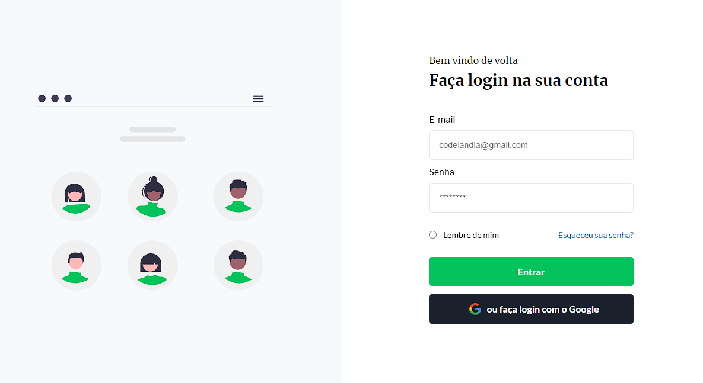

# Desafio-04-Login
Desafio 04 - Login (by Codelandia)

<!---Esses são exemplos. Veja https://shields.io para outras pessoas ou para personalizar este conjunto de escudos. Você pode querer incluir dependências, status do projeto e informações de licença aqui--->

  

> Desafio 04 Codelandia - Tela de Login

### [Ver Preview](https://guilhermesdb.github.io/Desafio-04-Login/)

## 👨🏻‍💻 Techs 

 

## 🤝 Colaboradores

Agradecemos às seguintes pessoas que contribuíram para este projeto:

<table>
  <tr>
    <td align="center">
      <a href="#">
         
        
          <b>Guilherme S Barros</b>
        
      </a>
    </td>
  </tr>
</table>

## 📝 Licença

Esse projeto está sob licença. Veja o arquivo [LICENÇA](LICENSE.md) para mais detalhes.

[⬆ Voltar ao topo](#Desafio-04-Login) 

